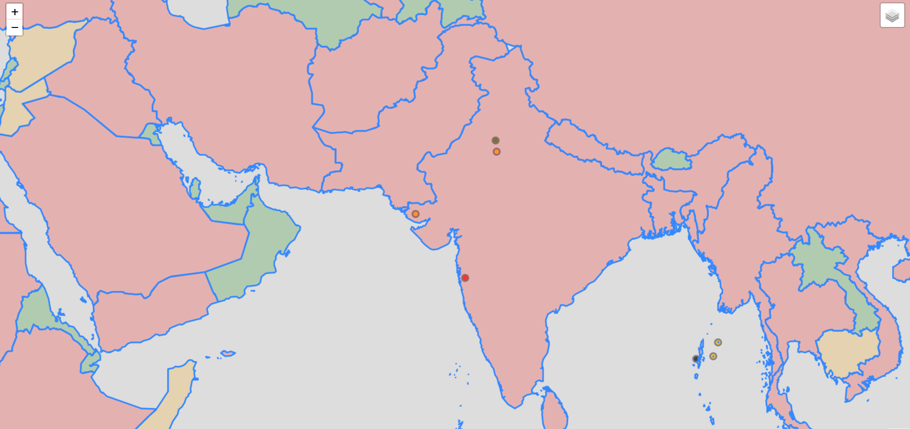

# PopulationFinder
A python script which scrapes the world population online and then maps(also applies color coding on the basis of population number) that along with some volcanoes' location.

This can be further modified so that it can shows the population density surrounding a area(by substituing the longitudes and latitudes of concerned locaions inplace of volcanoes) given that the population data of that area is accessible. And this application of the script can be used to manage and apply a more efficient way of crowd controlling.


**To generate map.html:**

```
pip install -r requirements.txt
python map.py
```

**Screenshot:**

* The color decisive factors can be better confgured according to the need of particular usecase.
